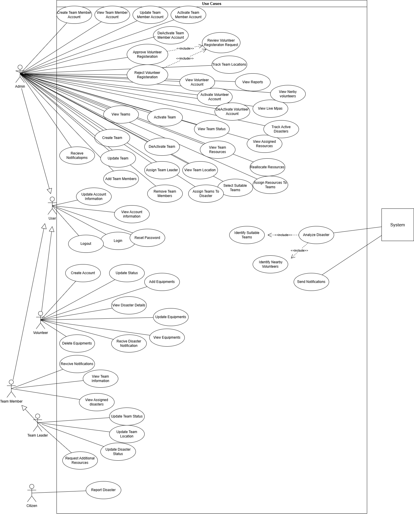
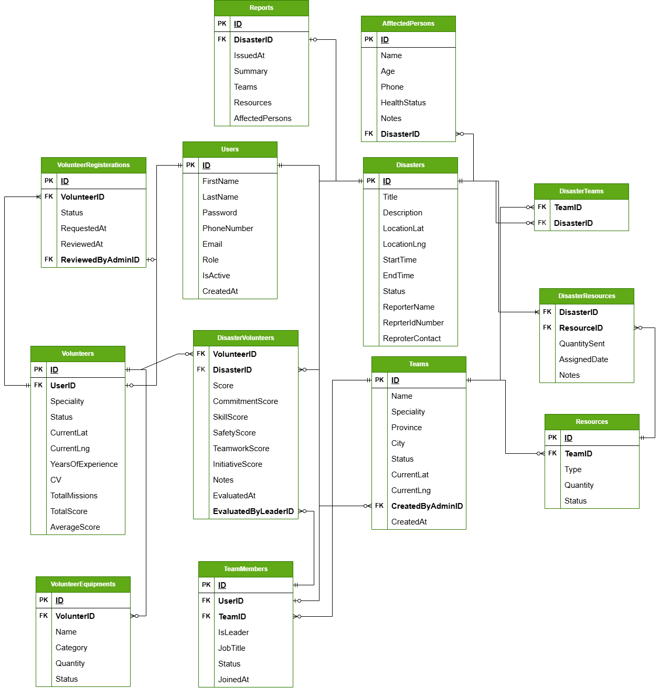
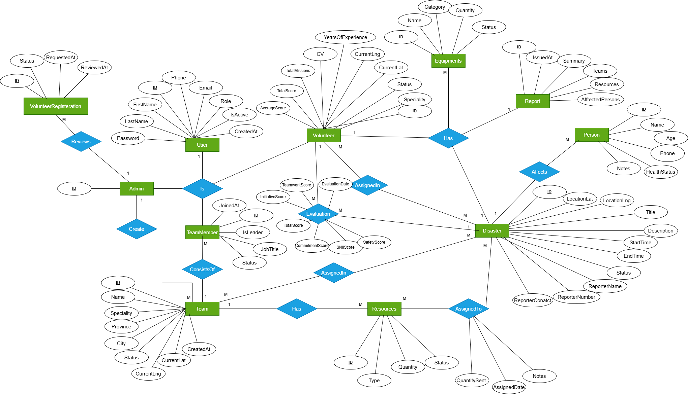

# Eghatha – Disaster Management System

Eghatha is a centralized Disaster Management System designed to support government authorities in coordinating disaster response operations.  
The system manages disasters, teams, volunteers, resources, and affected persons, and provides real-time tracking and decision support using geolocation and evaluation data.

---

## 🎯 Vision

To provide a smart, real-time, and data-driven platform that enables:
- Fast disaster reporting
- Optimal team and volunteer assignment
- Efficient resource distribution
- Live tracking of field operations
- Post-disaster evaluation and reporting

---

## 👥 System Actors

- **Admin (Government Authority)**
  - Manages users, teams, volunteers, disasters, and resources.
  - Assigns teams and resources to disasters.
  - Monitors live locations and generates final reports.

- **Team Leader**
  - Updates team status and location.
  - Updates disaster progress.
  - Requests additional resources.
  - Evaluates volunteers after mission completion.

- **Team Member**
  - Views assigned disasters.
  - Receives notifications.

- **Volunteer**
  - Registers and updates availability.
  - Receives nearby disaster alerts.
  - Manages owned equipment.
  - Participates in missions and gets evaluated.

- **Citizen (Reporter)**
  - Reports disasters via public form (no account required).

- **System (Decision Support Engine)**
  - Analyzes disaster data.
  - Suggests nearest and most suitable teams.
  - Ranks volunteers by distance, experience, and performance.
  - Sends real-time notifications.

---

## 🚀 Core Features

- Disaster reporting and lifecycle management
- Team and resource assignment
- Volunteer matching and evaluation
- Geographical distance calculation via external API
- Real-time tracking and notifications using SignalR
- Post-disaster reporting and analytics

---

## 🧱 Architecture

The project follows **Clean Architecture** with **CQRS** and **Domain-Driven Design** principles.

### Layers

API
├── Application (CQRS, MediatR, Use Cases)
│ └── Domain (Entities, Aggregates,  Business Rules)
│ └── Infrastructure (EF Core, Identity, SignalR, External APIs)
└── Tests (Unit & Integration Tests)

### Architectural Patterns

- Clean Architecture
- CQRS with MediatR
- Repository & Unit of Work
- Domain Events

## 🔐 Authentication & Authorization

- ASP.NET Identity
- Role-based access control:
  - Admin
  - TeamLeader
  - TeamMember
  - Volunteer

---

## ⚡ Real-Time Capabilities (SignalR)

- Live disaster status updates
- Real-time team location tracking
- Volunteer availability updates
- Instant notifications to admins, teams, and volunteers

---

## 🛠 Technology Stack

- ASP.NET Core Web API
- Clean Architecture
- CQRS + MediatR
- Entity Framework Core
- ASP.NET Identity
- SignalR
- SQL Server
- External Geo-Distance API
- xUnit / FluentAssertions
- GitHub Actions (CI/CD )

## 📐 Diagrams

### Use-Case Diagram

### ERD Diagram

### ER Diagram

